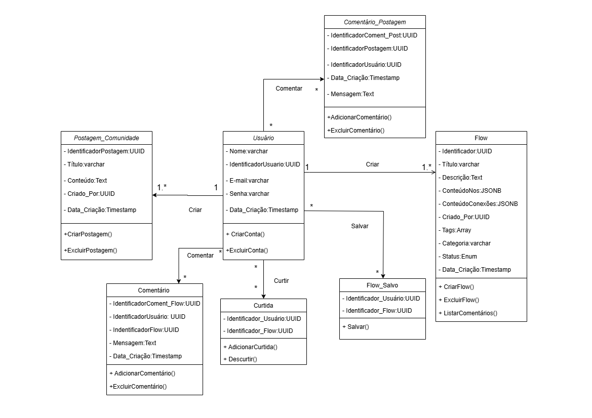
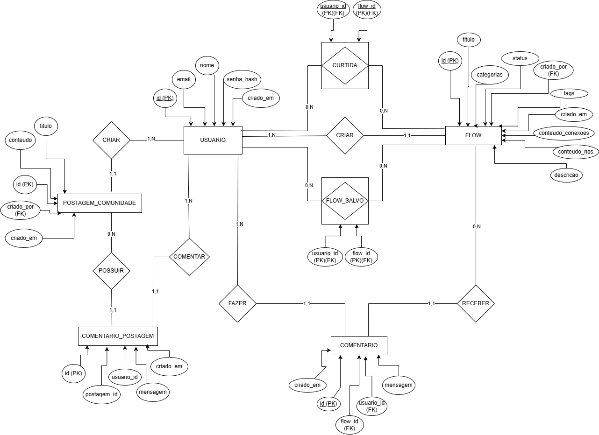
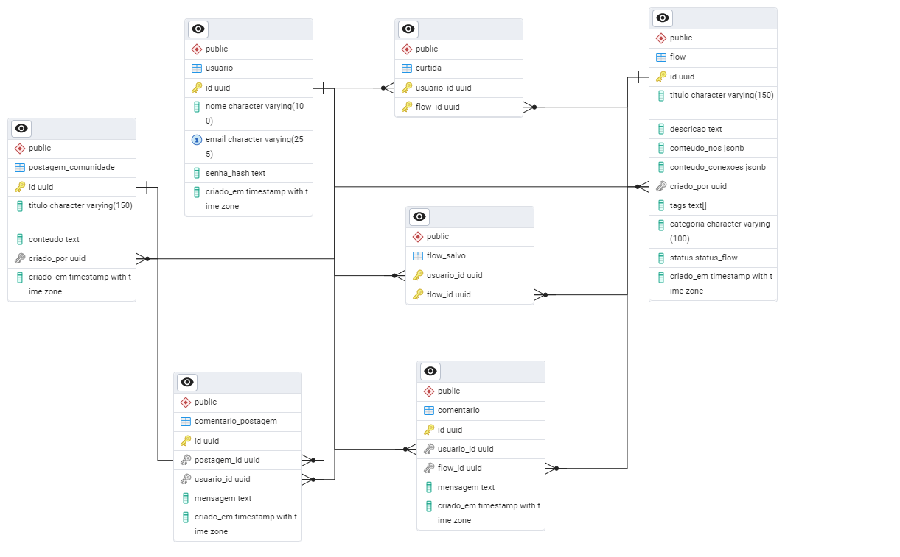

# Arquitetura da solução

<span style="color:red">Pré-requisitos: <a href="05-Projeto-interface.md"> Projeto de interface</a></span>

A arquitetura da solução do KnowFlow é baseada em uma abordagem modular e escalável, dividida em três camadas principais: frontend, backend e banco de dados, além de um ambiente de hospedagem em nuvem para garantir acessibilidade e performance.

https://raw.githubusercontent.com/ICEI-PUC-Minas-PCO-SI/2025-1-p3-tiapn-si-grupo-1/refs/heads/main/docs/images/Arquitetura_Solucao.png


## Diagrama de classes

O diagrama de classes ilustra graficamente a estrutura do software e como cada uma das classes estará interligada. Essas classes servem de modelo para materializar os objetos que serão executados na memória.





##  Modelo de dados

### Modelo Entidade-Relacionamento

O Modelo Entidade-Relacionamento do KnowFlow Process apresenta uma representação conceitual da estrutura de dados do sistema. Ele define as entidades principais, bem como seus respectivos atributos e relacionamentos. O MER abstrai detalhes técnicos e foca na lógica do negócio, sendo fundamental para garantir uma base sólida e coerente na construção do banco de dados, promovendo uma visão clara e estruturada das informações que o sistema irá manipular.



### Esquema relacional

O Esquema Relacional do KnowFlow Process traduz o modelo conceitual em uma estrutura lógica que será aplicada ao banco de dados. Utilizando a notação "pé de galinha", o DER detalha as entidades, seus atributos, chaves primárias e estrangeiras, bem como os tipos de relacionamentos entre elas. Através dele, é possível visualizar como os dados serão organizados, interligados e armazenados no sistema, garantindo a integridade referencial e a eficiência nas operações do banco de dados.



### Modelo físico

```sql
CREATE TABLE usuario (
  id UUID PRIMARY KEY,
  nome VARCHAR(100) NOT NULL,
  email VARCHAR(255) UNIQUE NOT NULL,
  senha_hash TEXT NOT NULL,
  criado_em TIMESTAMP WITH TIME ZONE DEFAULT NOW()
);

CREATE TYPE status_flow AS ENUM ('rascunho');

CREATE TABLE flow (
  id UUID PRIMARY KEY,
  titulo VARCHAR(150) NOT NULL,
  descricao TEXT,
  conteudo_nos JSONB NOT NULL,
  conteudo_conexoes JSONB NOT NULL,
  criado_por UUID REFERENCES usuario(id),
  tags TEXT[] DEFAULT '{}',
  categoria VARCHAR(100),
  status status_flow NOT NULL DEFAULT 'rascunho',
  criado_em TIMESTAMP WITH TIME ZONE DEFAULT NOW()
);
CREATE TABLE comentario (
  id UUID PRIMARY KEY,
  usuario_id UUID REFERENCES usuario(id),
  flow_id UUID REFERENCES flow(id),
  mensagem TEXT NOT NULL,
  criado_em TIMESTAMP WITH TIME ZONE DEFAULT NOW()
);
CREATE TABLE curtida (
  usuario_id UUID REFERENCES usuario(id),
  flow_id UUID REFERENCES flow(id),
  PRIMARY KEY (usuario_id, flow_id)
);
CREATE TABLE flow_salvo (
  usuario_id UUID REFERENCES usuario(id),
  flow_id UUID REFERENCES flow(id),
  PRIMARY KEY (usuario_id, flow_id)
);
CREATE TABLE postagem_comunidade (
  id UUID PRIMARY KEY,
  titulo VARCHAR(150) NOT NULL,
  conteudo TEXT NOT NULL,
  criado_por UUID REFERENCES usuario(id),
  criado_em TIMESTAMP WITH TIME ZONE DEFAULT NOW()
);
CREATE TABLE comentario_postagem (
  id UUID PRIMARY KEY,
  postagem_id UUID REFERENCES postagem_comunidade(id),
  usuario_id UUID REFERENCES usuario(id),
  mensagem TEXT NOT NULL,
  criado_em TIMESTAMP WITH TIME ZONE DEFAULT NOW()
);
```

## Tecnologias

A camada de front-end será desenvolvida utilizando React em conjunto com Vite, visando a criação de uma SPA (Single Page Application) com carregamento otimizado e boa performance. A interface do usuário será construída com componentes reutilizáveis estilizados por meio de Styled Components, aplicando a abordagem CSS-in-JS para isolar escopos de estilo. A biblioteca Material UI Icons (MUI) será utilizada para garantir consistência visual e acessibilidade. Para a construção visual de fluxogramas e estruturas interativas, será utilizado o React Flow, enquanto a edição de conteúdo rich text dentro dos nós será feita com o Editor.js. Todo o desenvolvimento do front será realizado na IDE Visual Studio Code.

A camada de back-end será baseada no Node.js, utilizando o Express como framework principal para criação de uma API RESTful modular e escalável. Os dados serão persistidos em um banco PostgreSQL, com o uso do ORM Sequelize para facilitar o mapeamento objeto-relacional. Também serão utilizados campos do tipo JSONB no banco, possibilitando o armazenamento de dados semiestruturados com flexibilidade. A autenticação será gerenciada com Firebase Auth, permitindo a integração direta com o front-end. Em ambientes alternativos, poderá ser adotado o padrão JWT (JSON Web Token) para controle de sessões.

Ferramentas como Postman e Insomnia serão utilizadas para testes de endpoints, autenticação e verificação de payloads da API, garantindo a confiabilidade das rotas durante o processo de desenvolvimento. O versionamento de código será controlado via Git, com repositórios hospedados no GitHub, permitindo colaboração, histórico de alterações e integração contínua com outras ferramentas.

| Dimensão       | Tecnologia                                                                    |
|----------------|--------------------------------------------------------------------------------|
| Front-end      | React + Vite + Styled Components + React Flow + Editor.js + MUI Icons         |
| Back-end       | Node.js + Express                                                             |
| SGBD           | PostgreSQL + Sequelize + JSONB                                                |
| Autenticação   | Firebase Auth + JWT (opcional)                                                |
| Testes de API  | Postman + Insomnia                                                            |
| Versionamento  | Git + GitHub                                                                  |
| IDE            | Visual Studio Code                                                            |


## Hospedagem

Explique como a hospedagem e o lançamento da plataforma foram realizados.

> **Links úteis**:
> - [Website com GitHub Pages](https://pages.github.com/)
> - [Programação colaborativa com Repl.it](https://repl.it/)
> - [Getting started with Heroku](https://devcenter.heroku.com/start)
> - [Publicando seu site no Heroku](http://pythonclub.com.br/publicando-seu-hello-world-no-heroku.html)

## Qualidade de software

Conceituar qualidade é uma tarefa complexa, mas ela pode ser vista como um método gerencial que, por meio de procedimentos disseminados por toda a organização, busca garantir um produto final que satisfaça às expectativas dos stakeholders.

No contexto do desenvolvimento de software, qualidade pode ser entendida como um conjunto de características a serem atendidas, de modo que o produto de software atenda às necessidades de seus usuários. Entretanto, esse nível de satisfação nem sempre é alcançado de forma espontânea, devendo ser continuamente construído. Assim, a qualidade do produto depende fortemente do seu respectivo processo de desenvolvimento.

A norma internacional ISO/IEC 25010, que é uma atualização da ISO/IEC 9126, define oito características e 30 subcaracterísticas de qualidade para produtos de software. Com base nessas características e nas respectivas subcaracterísticas, identifique as subcaracterísticas que sua equipe utilizará como base para nortear o desenvolvimento do projeto de software, considerando alguns aspectos simples de qualidade. Justifique as subcaracterísticas escolhidas pelo time e elenque as métricas que permitirão à equipe avaliar os objetos de interesse.

> **Links úteis**:
> - [ISO/IEC 25010:2011 - Systems and Software Engineering — Systems and Software Quality Requirements and Evaluation (SQuaRE) — System and Software Quality Models](https://www.iso.org/standard/35733.html/)
> - [Análise sobre a ISO 9126 – NBR 13596](https://www.tiespecialistas.com.br/analise-sobre-iso-9126-nbr-13596/)
> - [Qualidade de software - Engenharia de Software](https://www.devmedia.com.br/qualidade-de-software-engenharia-de-software-29/18209)
