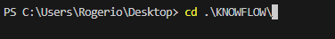
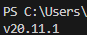

# 🧪 KnowFlow Process - Teste do Backend

Este repositório contém arquivos necessarios para usar as rotas do projeto knowflow

## 🚀 Instalação e Execução


1 - Crie uma pasta no seu computador chamada Knowflow 


2 - Abra seu Editor de Código nesta pasta vazia



3 - Faça o clone do repositorio com o comando: 

```bash
git clone https://github.com/ICEI-PUC-Minas-PCO-SI/2025-1-p3-tiapn-si-grupo-1.git .
```

4 - Certifique-se no seu terminal que você possui NodeJs instalado com o comando:

```bash
node -v
```



5 - Caso não possua realize a instalação pelo link:

```bash
https://nodejs.org/dist/v22.16.0/node-v22.16.0-x64.msi
``` 

6 - Ainda no diretório Knowflow nave até pasta do back:

```bash
cd src/back
```

7 - Apos isso instale as dependencias do projeto:

```
npm install
```

7 - Crie um Arquivo .env na raiz da pasta back:


8 - Coloque o conteudo no arquivo .env ou dados do seu Postgres:
```bash
DATABASE_DIALECT=postgres
PGHOST={HOST}
PGUSER={USER}
PGPORT={PORT}
PGDATABASE={DATABASE_NAME}
PGPASSWORD={DATABASE_PASSWORD}
JWT_SECRET={FRASE_SEGURA}
```


## 📖 Testes


